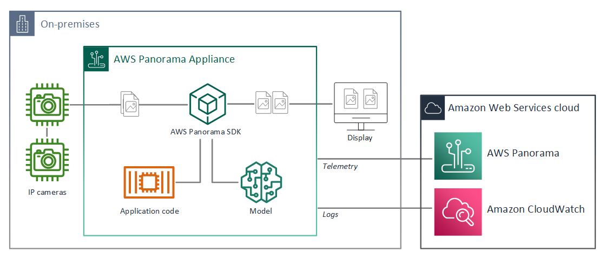
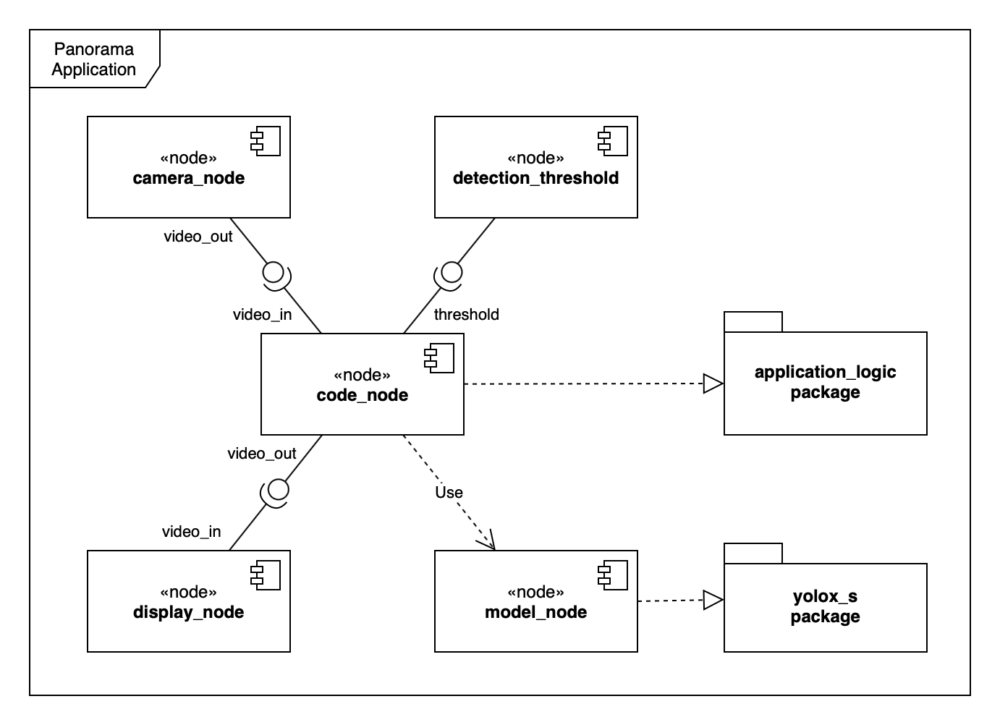

*A STEP-BY-STEP GUIDE TO AWS PANORAMA MODEL DEPLOYMENT*

# Deploy an Object-Detector Model at the Edge on AWS Panorama

Learn how to deploy state-of-the-art computer vision models on AWS Panorama, a powerful edge device to realize online and cost-effective object detection.

<figure>

<figcaption><em>Photo by <a href="https://unsplash.com/@v2osk">v2osk</a> on <a href="https://unsplash.com">Unsplash</a></em></figcaption>
</figure>

*This article was co-authored by [Janos Tolgyesi](http://twitter.com/jtolgyesi) and [Luca Bianchi](https://twitter.com/bianchiluca).*

In recent years, Computer Vision has become one of the most exciting fields of application for Deep Learning: trained convolutional neural networks (CNN) models can reach human-like accuracy levels detecting objects within an image or a video stream. These incredible advancements opened a broad field of application ranging from retail customer behavior analysis to security and industrial quality assurance.

In this scenario, a couple of different deep learning models emerged to solve a frequent use case for computer vision: object detection. It is a desirable result per se and a universal foundation of a wide range of applications such as object tracking, pose estimation, and environment monitoring.

Moreover, when video cameras produce input images, modern computer vision capabilities raise the bar of what is achievable with object detection deep learning models applied to security and monitoring. Such scenarios are nevertheless highly challenging due to the short response time requirement of real-time applications. An alarm should fire within a few seconds from danger detection; otherwise, it would be useless or even harmful.

Latency plays a significant role in defining constraints to the kind of computation available. Due to restricted bandwidth and unreliable networks, streaming massive video streams to the cloud, processing the video by fast and accurate deep learning model running on a cloud instance is often not feasible or has prohibitive costs. Video analysis constantly requires high provisioned computation capacity, and this requirement fades the advantages of an on-demand or serverless-like, autoscaling infrastructure. Additionally, bandwidth is never cost-effective, making such solutions unaffordable in most use cases.

Edge computing became a desirable solution to achieve better latencies and lower the total system cost, opening an entirely new market. Unfortunately, building reliable and not expensive hardware with a GPU to run a computer vision model is not an easy task for most data scientists. Considering that the video streams managed by some use cases might contain sensitive information of people’s video footage, security requirements make this task is even more difficult.

## Entering AWS Panorama

In the 2020 virtual edition of Amazon re:Invent, former CEO of Amazon Web Services Andy Jassy [presented a new device](https://aws.amazon.com/about-aws/whats-new/2020/12/introducing-aws-panorama-for-computer-vision-at-the-edge/) named AWS Panorama, wholly designed for edge computing. Inside a small package with a compact design and an IP5 enclosure, an Nvidia Jetson Xavier graphic processing unit can analyze up to 16 concurrent video streams. The device’s appearance and setup are presented more in detail in the [amazing video](https://www.youtube.com/watch?v=xRxAWClUTZc) by AWS Machine Learning Hero Mike Chambers.
The easy initial configuration and provisioning experience makes Panorama suitable for installation for non-technical users.

## Development concepts

Under the hood, AWS Panorama does not just deploy a deep learning model but requires the developer to define a *Panorama Application*. A *Panorama Application* is a collection of packaged deep learning models, business logic code, and a manifest structure (application graph) that defines the data pipeline between these components.

The application components are called *nodes*. Every resource on the device is represented by a *node*: deep learning models, business logic code, camera streams, even display output, and parameters. Each *node* has one or more *interfaces* that define its *inputs* and *outputs*. Before deployment, the model and code-type *node* resources are archived into binary *assets*. The *assets* together with a *manifest file* (`package.json`) are referred to as *packages*. The package’s *manifest file* contains all the information about its *assets* and defines the *interfaces* used within the *application graph*. Additional node-specific details can be provided in a *package descriptor*, for example, the dimensions of the input tensor of the deep learning model or the application executable entry point. The *packages* are uploaded to an S3 access point managed by the AWS Panorama service and registered with the service.

When the developer is deploying the application with the AWS Panorama service, an *application manifest file* (`graph.json`) should be provided, defining the application as a graph built up from nodes and edges. At deployment time, the Panorama service finds the registered *packages* referred by name in the *manifest file* and downloads them to the Panorama appliance.

In summary:

- A *Panorama application* is a collection of connected *nodes*. The connections are described by the *application manifest* (or application graph).
- The *nodes* can have the following types: deep learning model, application source code, camera input, display output, and deploy-time parameters.
- The *nodes* also define their *interfaces*. An *interface* is a list of *input* and *output ports*. The ports are named and typed data fields. Numeric, boolean, string, and "media" types are supported.
- Application code and ML models are archived into *assets*. The *assets*, together with their manifest file, are referred to as *packages*. *Packages* are uploaded and registered by the Panorama service.
- At deployment time, the user should specify the *application graph*. The Panorama service looks up the *packages* associated with the single *nodes* in the graph and downloads the required packages to the appliance.

For additional information, refer to the [AWS Panorama Developer Guide](https://docs.aws.amazon.com/panorama/latest/dev/).

## Choosing a state-of-the-art computer vision model for object detection

You Only Look Once (YOLO) deep learning model for real-time object detection was [presented at CVPR 2016](https://arxiv.org/pdf/1506.02640v5.pdf). Since then, it has become the standard benchmark for this kind of task. It provides real-time inference performance, generalized object representation understanding (improved accuracy on never seen before images), and scale along the model size / accuracy axis. In contrast to earlier Region-Based Convolutional Neural Networks (R-CNN), YOLO models process the image in just one step. The models have dramatically improved in the following years, introducing a wide range of enhancements, moving through YoloV2, YoloV3, YoloV4, and YoloV5.

YOLO models can detect objects and identify their position within an image, drawing a bounding box encompassing them. In earlier implementations, the models used a list of pre-defined bounding boxes called anchors and predicted their offset within the image. This approach requires specifying the number of anchors to be detected within a given image region, which can be constraining in some use cases.

In 2021 the model was further improved, adopting an anchor-free approach with the rise of [YOLOX](https://arxiv.org/abs/2107.08430). YOLOX is implemented in PyTorch, and pre-trained models on the COCO dataset are [released on GitHub](https://github.com/Megvii-BaseDetection/YOLOX). The [COCO dataset](https://cocodataset.org/) contains [80 different object classes](https://tech.amikelive.com/node-718/what-object-categories-labels-are-in-coco-dataset/) including persons, vehicles, some animals, sports equipment, and everyday objects, so the pre-trained model is ready to detect these objects out-of-the-box.

## Creating a Panorama Application

### Prerequisites

To follow this step-by-step guide, an AWS Account and an AWS Panorama device are needed. The Panorama device should be provisioned into the account (please refer to Mike’s tutorial above for these steps).

An RTSP stream is also required for testing the solution, and the Panorama appliance should be able to access it from the network to that it is connected. The stream can be provided by most IP cameras or by a computer running an RTSP server.

The deployment steps will be carried out using AWS Command Line Interface (CLI) and Panorama (CLI), starting from the sample application provided in the [AWS Panorama Developer Guide](https://docs.aws.amazon.com/panorama/latest/dev/gettingstarted-deploy.html). Ensure that the AWS CLI, the Panorama CLI, and Docker are installed and configured on your workstation.

<figure>

<figcaption><em>Panorama Sample Application. Diagram from <a href="https://github.com/awsdocs/aws-panorama-developer-guide/blob/main/docs-source/gettingstarted-sample.md">AWS Panorama Developer Guide</a> (CC BY-SA 4.0).</em>
</figcaption>
</figure>

This tutorial also comes with an accompanying [GitHub repository](https://github.com/mrtj/yolox-panorama-tutorial), where you can follow the evolution of the project commit by commit, and use it as a reference if you are stuck. We will provide a link to the relevant commit after each step with the bookmark icon: 🔖.

### The packages of a Panorama application

First of all, initialize a project using init-project command of AWS Panorama CLI:

```shell
$ panorama-cli init-project --name yolox-panorama
```

This command will generates an empty project template. It is just a scaffolding with empty folders named `assets` and `packages`, and a JSON file in `graphs/yolox-panorama/graph.json`. [GitHub checkpoint: 🔖](https://github.com/mrtj/yolox-panorama-tutorial/commit/88ba525)

To deploy a Panorama application, at least the following nodes have to be defined:

- camera input,
- model (will wrap YOLOX),
- application code (business logic), and
- display output (HDMI, for debug).

AWS Panorama defines a particular concept, the “abstract nodes”, because during application development the exact RTSP URI is unknown since it is dependent on the source camera stream.

This abstraction allows the same application to be released to different appliances, processing different streams (with different RTSP URIs). The Panorama SDK provides an “abstract camera,” a placeholder node for a camera whose connection URI will be defined at deployment time.

The abstract camera node is added running using the

    add-panorama-package --type camera

command of Panorama CLI. Defining abstract nodes for cameras is not mandatory: a specific RTPS camera stream can be added, using the command

    create-package --type camera

then providing the camera RTSP URI, username, and password inside the “interfaces” field of the generated file `packages/${AWS_ACCOUNT_ID}-[camera_name]-1.0/package.json`.

AWS Panorama also offers another type of abstract node to map an HDMI display output. Using this media sink, an annotated video can be displayed on an HDMI monitor connected to the Panorama appliance. A note to consider is that the display is for debugging purposes, and only one application can use it at a time, the first one that was deployed using such a resource.

Wrapping together all the commands so far, the configuration is achieved through:

```shell
$ panorama-cli add-panorama-package --type camera --name camera_input
$ panorama-cli add-panorama-package --type data_sink --name display_output
$ panorama-cli create-package --type Container --name application_logic
$ panorama-cli create-package --type Model --name yolox_s
```

*Adding packages to a Panorama Application. [GitHub checkpoint 🔖](https://github.com/mrtj/yolox-panorama-tutorial/commit/415ebae)*

### A note about AWS account IDs

Every Panorama project uses the owner’s AWS account ID in numerous project artifacts. It is used in the folder names, as well as in multiple JSON configuration files. The account ID is typically considered a piece of sensitive information that one might not want to expose publicly. In this tutorial, the account ID is replaced with `${AWS_ACCOUNT_ID}` in the command line examples. This expression refers to a variable that can be initialized with the real AWS account ID so that the shell will automatically substitute it. In the JSON snippets, we will use the dummy account ID `123456789012` that should be always replaced manually with the actual AWS account ID.

### Define the nodes of the application

The AWS Panorama CLI does not create nodes in the application graph for the business logic and the deep learning model, so the developer must add them manually.

This can be done by opening `graphs/yolox-panorama/graph.json` and adding the following objects in the `nodeGraph.nodes` array:

```json
{
    "name": "code_node",
    "interface": "123456789012::application_logic.interface"
},
{
    "name": "model_node",
    "interface": "123456789012::yolox_s.interface"
}
```
*Code and model nodes. [GitHub checkpoint: 🔖](https://github.com/mrtj/yolox-panorama-tutorial/commit/20ce1c8)*

*Parameters* can be added to a Panorama application, and their value will be specified at deployment time. The application logic can access the value of these parameters at runtime. Parameters are useful for a series of purposes: to define model-related parameters (for example, a detection threshold) or application settings (for example, an S3 bucket name). AWS Panorama supports the following parameter types: `int32`, `float32`, `boolean`, and `string`.

In this deployment, a single `float32` parameter represents the confidence threshold of the object detector. A detection confidence level below this threshold makes the relative object discarded. *Parameters* need to be added to the *application graph* manually as parameter-type *nodes*. Default values and overriding configuration can be specified along with a human-readable text displayed to the user at deployment time. Add the following object to the `nodes` array:

```json
{
    "name": "detection_threshold",
    "interface": "float32",
    "value": 20.0,
    "overridable": true,
    "decorator": {
        "title": "Threshold",
        "description": "The minimum confidence percentage for a positive classification."
    }
}
```

More information about parameters here can be found in the [relevant section](https://docs.aws.amazon.com/panorama/latest/dev/applications-manifest.html#applications-manifest-parameters) of the Panorama Developer Guide.

### Build the computer vision pipeline

Each node plays a particular role within the application: some emit information (`camera_node`, `detection_threshold`), others consume data (`display_node`), and some either emit and consume data such as `code_node` and `model_node`.

Edges direct the information that flows through the application, connecting an *output port* of a *node* to the *input port* of the following one. *Input* and *output ports* have a particular type, and only compatible types can be connected.

<figure>

<figcaption><em>The component diagram of the application being developed. Source: author’s own work.</em>
</figcaption>
</figure>

The detection threshold parameter and camera node are linked to the code node. The output of the code node is then linked to the display node. The model node is not connected to other nodes in the graph because the application logic handles information flow to/from the model. We will see later how to send input data to the model after pre-processing, and read out the inference results from the model for post-processing.

Nodes are connected through edges in the `graphs/yolox-panorama/graph.json`:

```json
"edges": [
    {
        "producer": "camera_node.video_out",
        "consumer": "code_node.video_in"
    },
    {
        "producer": "code_node.video_out",
        "consumer": "display_node.video_in"
    },
    {
        "producer": "detection_threshold",
        "consumer": "code_node.threshold"
    }
]
```
*Edges of an application graph. [GitHub checkpoint: 🔖](https://github.com/mrtj/yolox-panorama-tutorial/commit/6906b83)*

### Add machine learning model artifact

The YOLOX model has to be converted to TorchScript, one of the formats supported by AWS Panorama. The full workflow is outlined in the `yolox-torchscript` [Jupyter notebook](https://github.com/mrtj/yolox-panorama-tutorial/blob/main/yolox-torchscript.ipynb).

One important aspect is to remember the expected input shape of the exported model, which is needed at a later stage when writing inference code. For image processing models, the input shape has the format of `[batch_size, channel_size, width, height]`. In this case, `batch_size` is `1`, channel_size equals `3` (red, green, blue), and model specifications define `width` and `height`. For *yolox-s* model the input shape is `[1, 3, 640, 640]`.

In the last steps of the Jupyter notebook, the TorchScript model is saved as a `.tar.gz` package. This archive will be used to create the *package* of the model node.

The Panorama CLI adds the archive as a project asset, taking the path of the `.tar.gz` file in the `--model-local-path` parameter. Before issuing any of these commands, it is important to export the local AWS account ID to have reproducible and portable steps.

```shell
$ AWS_ACCOUNT_ID=$(aws sts get-caller-identity --output text --query 'Account')
$ panorama-cli add-raw-model \
    --model-asset-name yolox_s_asset \
    --model-local-path [model_archive_path]/yolox_s_torchscript.tar.gz \
    --descriptor-path packages/${AWS_ACCOUNT_ID}-yolox_s-1.0/descriptor.json \
    --packages-path packages/${AWS_ACCOUNT_ID}-yolox_s-1.0
```
*Add model to the Panorama application. [GitHub checkpoint: 🔖](https://github.com/mrtj/yolox-panorama-tutorial/commit/6b3c522)*

The result is a new node in `graph.json`, named `yolox_s_asset`, that should be merged to the already created `model_node`. Edit the `nodes` list in a way that only one node remains with this contents:

```json
{
    "name": "model_node",
    "interface": "123456789012::yolox_s.interface",
    "overridable": false,
    "launch": "onAppStart"
}
```
*The merged model node*

The `interface` field refers to the `interface` attribute in the `yolox_s` *package*. The interface name created by Panorama CLI can be changed to a more suitable one, editing the `name` attribute simply to `"interface"` in the `nodePackage.interfaces` array inside `packages/${AWS_ACCOUNT_ID}-yolox_s-1.0/package.json`.

```json
{
    "nodePackage": {
        ...
        "interfaces": [
            {
                "name": "interface",
                "category": "ml_model",
                "asset": "yolox_s_asset",
                ...
            }
        ]
    }
}
```
*Corrected model interface. [GitHub checkpoint: 🔖](https://github.com/mrtj/yolox-panorama-tutorial/commit/761d34c)*

The model descriptor at `packages/${AWS_ACCOUNT_ID}-yolox_s-1.0/descriptor.json` should contain additional required metadata about your model. Edit this file and adding the framework name `PYTORCH` and the input name and shape. The final version of the model descriptor should look like this:

```json
{
    "mlModelDescriptor": {
        "envelopeVersion": "2021-01-01",
        "framework": "PYTORCH",
        "inputs": [
            {
                "name": "images",
                "shape": [1, 3, 640, 640]
            }
        ]
    }
}
```
*The model descriptor. [GitHub checkpoint: 🔖](https://github.com/mrtj/yolox-panorama-tutorial/commit/f380ee4)*

### Implementing a computer vision pipeline

A computer vision application deployed on AWS Panorama should implement at least the following functionalities:
- continuously query the last frame from the video stream,
- preprocess the frame and convert it into a NumPy array that has the same shape as the deep learning model’s input,
- pass the preprocessed frame to the model (it is already initialized for you by the model node),
- read the inference results and eventually post-process them,
- annotate the frame with the inference result bounding boxes,
- send the annotated frame to the downstream display node.

In addition to these basic video pipeline handling steps, a model usually implements some business logic, for example:

- counting the number of persons and measuring the distance between them,
- generating alarms if certain conditions verify, for example, the persons do not respect social distancing rules,
- send these alarms to interested parties using a messaging protocol, for example, MQTT or AWS SNS,
- generate business metrics and persistent them (for example, in CloudWatch or in an S3 bucket via Amazon Kinesis Data Firehose) that can be later used for analytics purposes,
- in general, integrate with downstream business applications, or
- take a “screenshot” of an interesting frame and upload it to a data storage service.

In this tutorial we implement only the media pipeline, with no particular emphasis on the business logic. The main focus is to display the video stream on the HDMI monitor, then integrate the YOLOX object detector model.

### Build a Panorama application with an Open Container Image format

AWS Panorama uses the Open Container Image (OCI) format, to provide the context for an application to run on the device. A minimal docker file, bundled with OpenCV and NumPy to handle respectively images and arrays in Python can be crafted from the stub file created by the Panorama CLI in `packages/${AWS_ACCOUNT_ID}-application_logic-1.0/Dockerfile`.

The resulting file should resemble:

```dockerfile
FROM public.ecr.aws/panorama/panorama-application
RUN pip install --no-cache-dir --upgrade pip && \
    pip install --no-cache-dir opencv-python numpy
COPY src /panorama
```
*The Dockerfile of the application node. [GitHub checkpoint: 🔖](https://github.com/mrtj/yolox-panorama-tutorial/commit/536eda1)*

The Dockerfile above performs the following steps:

1. Builds on top of the `panorama-application` base image (this is obligatory for all Panorama applications). This base image contains the Panorama SDK, the infrastructure of communication with other nodes, and others.
2. Updates pip and installs OpenCV and NumPy.
3. Copies the contents of the host’s `src` folder inside the `/panorama` folder in the container.

Other required dependencies can be installed within the same Dockerfile as well.

### Define the interface of the application node

The first step to do before writing application code for inference is to define the *interface* of the code *node*: a construct that lists the *input* and *output ports*, providing a way to communicate with other *nodes*. The interface is defined in `packages/${AWS_ACCOUNT_ID}-application_logic-1.0/package.json`. Add these objects in the `nodePackage.interfaces` array:

```json
{
    "name": "interface",
    "category": "business_logic",
    "asset": "",
    "inputs": [
        {
            "name": "video_in",
            "type": "media"
        },
        {
            "name": "threshold",
            "type": "float32"
        }
    ],
    "outputs": [
        {
            "description": "Video stream output",
            "name": "video_out",
            "type": "media"
        }
    ]
}
```
*The interface of the application node. [GitHub checkpoint: 🔖](https://github.com/mrtj/yolox-panorama-tutorial/commit/cb7fae9)*

This defines the `video_in` input for the media stream, the `threshold` input as a `float32` parameter, and a `video_out` output for the downstream media consumers. Refer to the edges section of `graph.json` on how these inputs and outputs are connected with other nodes.

### Logging setup

Since there is no way to debug application logic directly on the Panorama appliance, diagnostic log messages need to be used to achieve application observability. Access to the standard output of the container running on Panorama is disabled, which means that printing messages to the stdout or using a naive configuration of Python logger will not work. Logging needs to be integrated with the logging infrastructure of the Panorama SDK.

The Panorama daemon watches `/opt/aws/panorama/logs` folder of the container running on the appliance: any text file written to this folder is going to be sent incrementally to AWS CloudWatch logs. This means that adding a log entry to a file in that folder pushes the new lines directly to the cloud.

A standard Python logger configuration to fulfill this by the following:

```python
import logging
from logging.handlers import RotatingFileHandler

def get_logger(name=__name__, level=logging.INFO):
    logger = logging.getLogger(name)
    logger.setLevel(level)
    handler = RotatingFileHandler(
        "/opt/aws/panorama/logs/app.log", 
        maxBytes=10000000, 
        backupCount=2
    )
    formatter = logging.Formatter(
        fmt='%(asctime)s %(levelname)-8s %(message)s',
        datefmt='%Y-%m-%d %H:%M:%S'
    )
    handler.setFormatter(formatter)
    logger.addHandler(handler)
    return logger
```
*Configuring the logger*

### Create an application stub

The stub of an application can be created in a new file called 
`packages/${AWS_ACCOUNT_ID}-application_logic-1.0/src/application.py` with the following contents:

```python
import panoramasdk
import numpy as np

class Application(panoramasdk.node):
    def __init__(self, logger):
        super().__init__()
        self.logger = logger
        self.threshold = 0.
        self.MODEL_NODE = 'model_node'
        self.MODEL_INPUT_NAME = 'images'
        self.MODEL_INPUT_SIZE = (640, 640)
        
        try:
            # Get parameter values
            self.logger.info('Getting parameters')
            self.threshold = self.inputs.threshold.get()
        except:
            self.logger.exception('Error during initialization.')
        finally:
            self.logger.info('Initialiation complete.')
            self.logger.info('Threshold: {}'.format(self.threshold))

    def process_streams(self):
        streams = self.inputs.video_in.get()
        for stream in streams:
            self.process_media(stream)
        self.outputs.video_out.put(streams)

    def process_media(self, stream):
        image_data, ratio = self.preprocess(stream.image, self.MODEL_INPUT_SIZE)
        inference_results = self.call(
            { self.MODEL_INPUT_NAME: image_data }, 
            self.MODEL_NODE
        )
        self.postprocess(inference_results, stream, ratio)

    def preprocess(self, img, size):
         return ((np.ones((size[0], size[1], 3), dtype=np.uint8) * 114), 1.0)

    def postprocess(self, inference_results, stream, ratio):
        pass
```

The initializer of the `Application` class saves the logger as an instance property and initializes the `threshold` property that later will be populated with the node parameter value. Actually, there is no way to retrieve the name and the expected input size of the model from the model node itself. For this reason, in this example they have been hardcoded.

Then, the `init` function reads the node parameter values. The inputs of the code node are defined in the node *interface* and accessible through `the self.inputs` property. The names of the inputs come from the code node *interface* definition. Here the value of the threshold parameter is read and saved as an instance property.

Whenever more than one camera is connected to the application, the `process_streams` method iterates over all input streams and call `process_media` for every one of them. At the end, it sends the modified (annotated) media streams to the `video_out` output, to be processed by downstream nodes, which here is going to be the HDMI display.

The `process_media` method computes every single frame of each stream. It passes the frame to the `preprocessor` method, calls the model node with the preprocessed frame, and finally post-processes the inference results.

The `preprocess` and the `postprocess` core functions are just stubbed here.

At last, the main application loop should be started, implementing an entry point for the application. Add the following at the end of `application.py`:

```python
def main():
    logger = get_logger(level=logging.DEBUG)
    try:
        logger.info('INITIALIZING APPLICATION')
        app = Application(logger)
        logger.info('PROCESSING STREAMS')
        # video processing loop:
        while True:
            app.process_streams()
    except:
        logger.exception('Exception during processing loop.')

main()
```
*The main video processing loop*

One last thing regarding to the application execution is to specify the entry point script of the processing container in the application’s package descriptor. Open `packages/${AWS_ACCOUNT_ID}-application_logic-1.0/descriptor.json` and modify it to the following:

```json
{
    "runtimeDescriptor": {
        "envelopeVersion": "2021-01-01",
        "entry": {
            "path": "python3",
            "name": "/panorama/application.py"
        }
    }
}
```
*The application descriptor. [GitHub checkpoint: 🔖](https://github.com/mrtj/yolox-panorama-tutorial/commit/e8874f6)*

### Building the application skeleton

Building the docker container is easy with Panorama CLI tool:

```shell
$ panorama-cli build-container \
    --container-asset-name code \
    --package-path packages/${AWS_ACCOUNT_ID}-application_logic-1.0
```
*Building the application container. [GitHub checkpoint: 🔖](https://github.com/mrtj/yolox-panorama-tutorial/commit/a3b7b55)*

After running this, edit the node section of `graphs/yolox-panorama/graph.json` to remove every code_node except the following and change the interface name to `interface`:

```json
{
    "name": "code_node",
    "interface": "${AWS_ACCOUNT_ID}::application_logic.interface",
    "overridable": false,
    "launch": "onAppStart"
}
```
*Leave only one valid code node in the application graph*

Sometimes, Panorama CI adds a second interface within `packages/${AWS_ACCOUNT_ID}-application_logic-1.0/package.json`. There should be only one of them, so after remove the redundant one, update the other as follows:

```json
"interfaces": [
    {
        "name": "interface",
        "category": "business_logic",
        "asset": "code_asset",
        "inputs": [
            {
                "name": "video_in",
                "type": "media"
            },
            {
                "name": "threshold",
                "type": "float32"
            }
        ],
        "outputs": [
            {
                "description": "Video stream output",
                "name": "video_out",
                "type": "media"
            }
        ]
    }
]
```
*Fixing application node’s interface. [GitHub checkpoint: 🔖](https://github.com/mrtj/yolox-panorama-tutorial/commit/4f51ea0)*

### Packaging the application

The AWS Panorama appliance downloads the application packages from a central package repository, implemented by an S3 access point, and maintained by AWS. The compiled package must be uploaded to this central repository with the following command:

```shell
$ panorama-cli package-application
```

Panorama CLI uses the [AWS CLI](https://aws.amazon.com/cli/) under the hoods to deploy the application’s assets, which means it is going to use the default configured AWS region. Make sure that the default region is the same region where the Panorama appliance was provisioned.

### Deploy the basic pipeline

The application can be deployed to the Panorama appliance as described in the [Panorama Developer Guide](https://docs.aws.amazon.com/panorama/latest/dev/gettingstarted-deploy.html). Since the application does not use any AWS service, there is no need to provide an IAM role for the application. After the deployment phase, the application has the control of the HDMI display (as long as it is the only application deployed to the device). The RTSP video stream coming from the camera is then shown on the screen. Apparently not a big achievement for so much work, but it sets the baseline for further development and closes the loop of deployment.

## Deploying the YOLOX object detector model to the AWS Panorama

The YOLOX model requires the input frames to be sent with a specific format and outputs raw predictions. This means that images have to be pre-processed and post-processed. Pre-processing consists of resizing the input frame to the correct dimensions. Post-processing is a fundamental step for object detection because it projects the prediction array to bounding boxes and detected object classes. These pre- and post-processing directly can be picked directly from the [YOLOX repository](https://github.com/Megvii-BaseDetection/YOLOX), double checking to have all the dependencies within the Docker image.

The original *yolox-s* PyTorch model has a dynamic computational graph that allows using dynamic sized inputs but this has some inference-time performance drawback. AWS Panorama requires the model in an optimized TorchScript format, using a static graph.

Pre-processing is all about resizing the input frame to 640 x 640 pixel input size. Resizing is achieved using a “fit+padding” strategy that does not crop any part of the image but resizes it in a way that the longer side of the image fits the 640 x 640 square. The eventually remaining empty space is padded with gray color. The logic is implemented in [`preproc`](https://github.com/Megvii-BaseDetection/YOLOX/blob/dd5700c24693e1852b55ce0cb170342c19943d8b/yolox/data/data_augment.py#L144) function of [`yolox/data/data_augment.py`](https://github.com/Megvii-BaseDetection/YOLOX/blob/dd5700c24693e1852b55ce0cb170342c19943d8b/yolox/data/data_augment.py) script in the YOLOX repository and should be added to the `packages/${AWS_ACCOUNT_ID}-application_logic-1.0/src/application.py`:

```python
import cv2

class Application(panoramasdk.node):
    
    # ...

    def preprocess(self, img, input_size, swap=(2, 0, 1)):
        if len(img.shape) == 3:
            padded_img = np.ones((input_size[0], input_size[1], 3), dtype=np.uint8) * 114
        else:
            padded_img = np.ones(input_size, dtype=np.uint8) * 114

        r = min(input_size[0] / img.shape[0], input_size[1] / img.shape[1])
        resized_img = cv2.resize(
            img,
            (int(img.shape[1] * r), int(img.shape[0] * r)),
            interpolation=cv2.INTER_LINEAR,
        ).astype(np.uint8)
        padded_img[: int(img.shape[0] * r), : int(img.shape[1] * r)] = resized_img

        padded_img = padded_img.transpose(swap)
        padded_img = np.ascontiguousarray(padded_img, dtype=np.float32)
        return padded_img, r
```
*Preprocessing the frame for the YOLOX detector*

The model outputs 8400 bounding box candidates of the detected objects, and a single detection can have multiple candidates. Using [Non-maximum suppression (NMS)](https://towardsdatascience.com/non-maximum-suppression-nms-93ce178e177c) algorithm in the post-processing method, it is possible to find the candidate with the highest probability to contain the actual object. The YOLOX repository contains this function and some other helpers that can be added to a newly created `packages/${AWS_ACCOUNT_ID}-application_logic-1.0/src/yolox_postprocess.py` file. Add the following functions from [`yolox/utils/demo_utils.py`](https://github.com/Megvii-BaseDetection/YOLOX/blob/2c2dd1397ab090b553c6e6ecfca8184fe83800e1/yolox/utils/demo_utils.py) in YOLOX repository to the `yolox_postprocess.py` file:

- `demo_postproces`
- `nms`
- `multiclass_nms`
- `multiclass_nms_class_aware`
- `multiclass_nms_class_agnostic`

The resulting `application.py` file, after having imported the NMS functions and wired them up in the `process_results` method should contain:

```python
from yolox_postprocess import demo_postprocess, multiclass_nms

class Application(panoramasdk.node):

    # ...
    
    def process_results(self, inference_results, stream, ratio):
        media_height, media_width, _ = stream.image.shape
        media_scale = np.asarray([media_width, media_height, media_width, media_height])
        for output in inference_results:
            boxes, scores, class_indices = self.postprocess(
                output, self.MODEL_INPUT_SIZE, ratio)
            for box, score, class_idx in zip(boxes, scores, class_indices):
                if score * 100 > self.threshold:
                    (left, top, right, bottom) = np.clip(box / media_scale, 0, 1)
                    stream.add_rect(left, top, right, bottom)

    def postprocess(self, result, input_shape, ratio):
        input_size = input_shape[-2:]
        predictions = demo_postprocess(result, input_size)
        predictions = predictions[0] # TODO: iterate through eventual batches

        boxes = predictions[:, :4]
        scores = predictions[:, 4:5] * predictions[:, 5:]

        boxes_xyxy = np.ones_like(boxes)
        boxes_xyxy[:, 0] = boxes[:, 0] - boxes[:, 2]/2.
        boxes_xyxy[:, 1] = boxes[:, 1] - boxes[:, 3]/2.
        boxes_xyxy[:, 2] = boxes[:, 0] + boxes[:, 2]/2.
        boxes_xyxy[:, 3] = boxes[:, 1] + boxes[:, 3]/2.
        boxes_xyxy /= ratio

        dets = multiclass_nms(boxes_xyxy, scores, nms_thr=0.45, score_thr=0.1)
        if dets is not None:
            final_boxes, final_scores, final_cls_inds = \
                dets[:, :4], dets[:, 4], dets[:, 5]

        boxes = final_boxes
        scores = final_scores
        class_indices = final_cls_inds.astype(int)
        return boxes, scores, class_indices
```
*Post-processing functions*

The `process_results` method iterates over the output of the model and calls the post-processor methods to extract the bounding boxes of the detections. The boxes are scaled to the `[0; 1]` interval as expected by the stream class of Panorama SDK. Then a rectangle is added for each detection for the output stream. The `postprocess` method (taken from [`demo/ONNXRuntime/onnx_inference.py`](https://github.com/Megvii-BaseDetection/YOLOX/blob/2c2dd1397ab090b553c6e6ecfca8184fe83800e1/demo/ONNXRuntime/onnx_inference.py#L73) in the YOLOX repository) converts the model output to the expected format of the Non-maximum Suppression algorithm.

Change the `process_media` method to invoke `process_results` instead of `preprocess`:

```python
class Application(panoramasdk.node):
    
    # ...
    
    def process_media(self, stream):
        image_data, ratio = self.preprocess(stream.image, self.MODEL_INPUT_SIZE)
        inference_results = self.call(
            {self.MODEL_INPUT_NAME: image_data}, self.MODEL_NODE
        )
        self.process_results(inference_results, stream, ratio)
```
*The final `process_media` method. [GitHub checkpoint: 🔖](https://github.com/mrtj/yolox-panorama-tutorial/commit/b987471)*

Now the application can be built and deployed to the Panorama appliance following the steps described in the previous sections. AWS Panorama sends application logs to CloudWatch console using the above configuration. It can be found filtering the logs with `/aws/panorama/devices/` log prefix.

## Where to go from here?

This article just scratched the surface of what can be achieved with computer vision at edge and AWS Panorama offers a great production environment to do that. This step-by-step tutorial is a first example about how a state-of-the-art object detection model can be deployed, allowing to recognize the 80 different object classes of the COCO dataset and locate them with a bounding box, showing the annotated video stream on an HDMI display.

From here a custom YOLOX model can be trained with a custom image dataset, then deployed to a Panorama application to implement a very specific classification.

On the "developer side" a lots of business logic can be added to build a complete service around the model, since with the proper IAM role, the application running in the Panorama device can directly access AWS resources such as S3 buckets, MQTT topics, SNS notifications, or CloudWatch metrics.

---

## About the authors

Janos Tolgyesi is an AWS Community Builder and Machine Learning Solution Architect at Neosperience. He works with ML technologies for five years and with AWS infrastructure for eight years. He loves building things, let it be a [video analytics application on the edge](https://www.neosperience.com/solutions/people-analytics/) or a [user profiler based on clickstream events](https://www.neosperience.com/solutions/user-insight/). You can find me on [Twitter](https://twitter.com/jtolgyesi), [Medium](https://medium.com/@janos.tolgyesi), and [LinkedIn](http://linkedin.com/in/janostolgyesi).

Luca Bianchi, PhD is an AWS Hero and Chief Technology Officer at Neosperience. He loves serverless and machine learning and is in charge of Neosperience Research and Development. Passionate about technology, ML and computer vision, can be contacted on [Twitter](https://twitter.com/bianchiluca), [Medium](https://medium.com/@aletheia), and [LinkedIn](https://www.linkedin.com/in/lucabianchipavia/).

Neosperience unlocks the power of empathy with software solutions that leverage AI to enable brands to understand, engage and grow their customer base. Reach out at [www.neosperience.com](https://www.neosperience.com).
